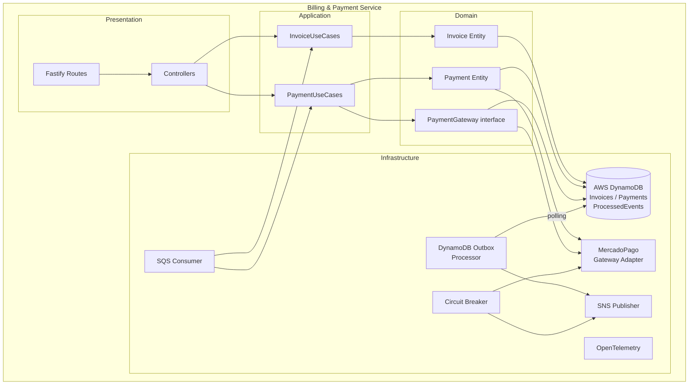
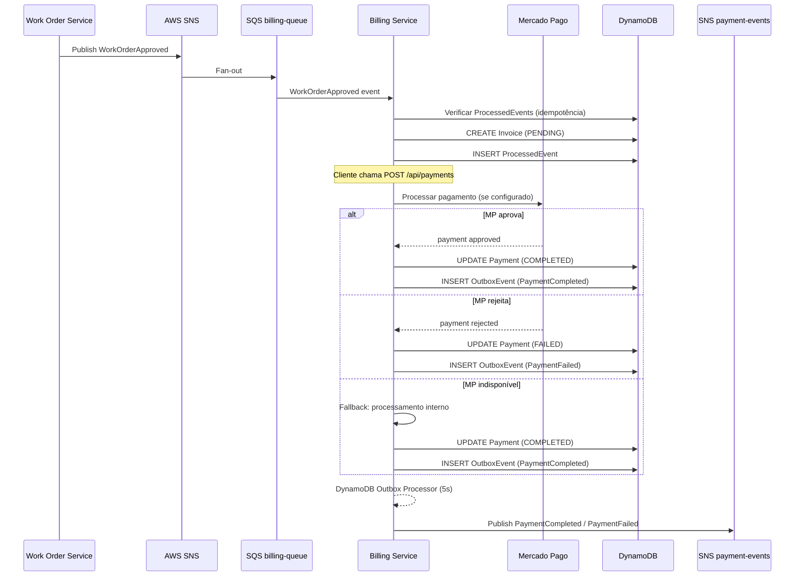

# Billing & Payment Service

> Microserviço responsável pela geração de faturas e processamento de pagamentos das ordens de serviço aprovadas, com suporte opcional à integração com Mercado Pago.

## Sumário

- [1. Visão Geral](#1-visão-geral)
- [2. Arquitetura](#2-arquitetura)
- [3. Tecnologias Utilizadas](#3-tecnologias-utilizadas)
- [4. Comunicação entre Serviços](#4-comunicação-entre-serviços)
- [5. Diagramas](#5-diagramas)
- [6. Execução e Setup](#6-execução-e-setup)
- [7. Pontos de Atenção](#7-pontos-de-atenção)
- [8. Boas Práticas e Padrões](#8-boas-práticas-e-padrões)
- [9. Repositórios Relacionados](#9-repositórios-relacionados)

---

## 1. Visão Geral

### Propósito

O **Billing & Payment Service** é o microserviço responsável por toda a camada financeira do sistema de oficina. Ele:

1. **Gera faturas (Invoice)** automaticamente ao receber a aprovação de uma ordem de serviço
2. **Processa pagamentos** — via Mercado Pago (se configurado) ou internamente
3. **Gerencia estornos (Refund)** quando uma OS é cancelada após pagamento
4. **Publica eventos de pagamento** consumidos pelo orquestrador da Saga (Work Order Service)

### Problema que Resolve

Em uma arquitetura distribuída com Saga Pattern, o resultado financeiro (pagamento aprovado ou rejeitado) é um evento crítico que define o próximo passo do fluxo. Este serviço:

- Isola toda a lógica financeira em um único bounded context
- Abstrai gateways de pagamento externos via interface (`PaymentGateway`)
- Garante idempotência via DynamoDB (tabela `ProcessedEvents`)
- Permite graceful degradation quando o gateway externo falha (fallback para processamento interno)

### Papel na Arquitetura

| Papel                     | Descrição                                                                         |
| ------------------------- | --------------------------------------------------------------------------------- |
| **Consumidor de eventos** | Assina fila SQS `billing-work-order-queue` para eventos da OS                     |
| **Produtor de eventos**   | Publica `PaymentCompleted`, `PaymentFailed`, `RefundCompleted` via SNS            |
| **API REST**              | Expõe endpoints para consultar faturas, processar pagamentos e solicitar estornos |
| **Gateway Adapter**       | Integra opcionalmente com Mercado Pago via padrão Adapter                         |

---

## 2. Arquitetura

### Clean Architecture

O serviço adota **Clean Architecture** com separação explícita de camadas:

```
src/
├── domain/           # Entidades (Invoice, Payment), enums, use-case interfaces, eventos
├── application/      # Implementações dos use cases, protocolos de infraestrutura
├── infra/
│   ├── db/           # DynamoDB client + repositórios (Invoices, Payments)
│   ├── gateway/      # MercadoPagoPaymentGateway (adapter)
│   ├── messaging/    # SQS Consumer, SNS Publisher, Outbox, DLQ Monitor
│   ├── circuit-breaker.ts
│   └── observability/
├── presentation/     # Controllers HTTP (Fastify route adapters)
├── validation/       # Schemas Zod
└── main/             # Composition root
```

### Decisões Arquiteturais

| Decisão                             | Justificativa                                                                                            | Trade-off                                            |
| ----------------------------------- | -------------------------------------------------------------------------------------------------------- | ---------------------------------------------------- |
| **DynamoDB** (em vez de PostgreSQL) | Esquema flexível para dados de fatura/pagamento, latência baixa de leitura, sem necessidade de migrações | Consultas complexas são limitadas; sem JOINs nativos |
| **Outbox via DynamoDB**             | Garante publicação de eventos SNS mesmo em falhas parciais                                               | Polling periódico adiciona latência de ~5s           |
| **PaymentGateway interface**        | Permite trocar o gateway (Mercado Pago → outro) sem mudar use cases                                      | Overhead de abstração em cenário simples             |
| **Graceful degradation**            | Fallback para processamento interno se Mercado Pago falhar                                               | Pode mascarar problemas de integração em produção    |
| **Idempotência via DynamoDB**       | Tabela `ProcessedEvents` evita duplicidade mesmo com redelivery da SQS                                   | Custo adicional de leitura/escrita no DynamoDB       |

### Padrões Utilizados

- **Adapter Pattern** — `MercadoPagoPaymentGateway` adapta o SDK externo à interface `PaymentGateway` do domínio
- **Outbox Pattern (DynamoDB)** — eventos publicados via `DynamoOutboxProcessor`
- **Idempotência** — deduplicação de mensagens SQS via tabela `ProcessedEvents`
- **Circuit Breaker** — protege chamadas ao Mercado Pago e SNS
- **DLQ Monitor** — alerta sobre mensagens em Dead Letter Queues

---

## 3. Tecnologias Utilizadas

| Tecnologia           | Versão | Propósito                                                  |
| -------------------- | ------ | ---------------------------------------------------------- |
| **Node.js**          | 22     | Runtime                                                    |
| **TypeScript**       | 5.9    | Linguagem                                                  |
| **Fastify**          | 5.2    | Framework HTTP                                             |
| **AWS DynamoDB**     | SDK v3 | Banco de dados NoSQL (Invoices, Payments, ProcessedEvents) |
| **AWS SNS**          | SDK v3 | Publicação de eventos de pagamento                         |
| **AWS SQS**          | SDK v3 | Consumo de eventos de OS                                   |
| **Mercado Pago SDK** | 2.x    | Gateway de pagamento externo (opcional)                    |
| **Zod**              | 4      | Validação de schemas                                       |
| **OpenTelemetry**    | 1.x    | Rastreamento distribuído e métricas                        |
| **Jest**             | 30     | Testes unitários                                           |
| **jsonwebtoken**     | 9      | Verificação de tokens JWT                                  |

**Infraestrutura**: AWS (DynamoDB, SNS, SQS), EKS, ECR, Secrets Manager.

**Nota**: este serviço **não usa PostgreSQL nem Prisma** — todo o estado é persistido no DynamoDB.

---

## 4. Comunicação entre Serviços

### Eventos Consumidos (SQS)

| Fila                       | Evento              | Ação                                           |
| -------------------------- | ------------------- | ---------------------------------------------- |
| `billing-work-order-queue` | `WorkOrderApproved` | Cria `Invoice` com valor do orçamento          |
| `billing-work-order-queue` | `WorkOrderCanceled` | Inicia estorno se houver pagamento `COMPLETED` |

### Eventos Publicados (SNS)

| Tópico           | Evento             | Gatilho                                          |
| ---------------- | ------------------ | ------------------------------------------------ |
| `payment-events` | `PaymentCompleted` | Pagamento processado com sucesso                 |
| `payment-events` | `PaymentFailed`    | Pagamento rejeitado pelo gateway ou internamente |
| `payment-events` | `RefundCompleted`  | Estorno processado com sucesso                   |

### Endpoints REST

| Método | Rota                                | Descrição                         | Auth    |
| ------ | ----------------------------------- | --------------------------------- | ------- |
| `GET`  | `/api/invoices/:workOrderId`        | Buscar fatura por OS              | JWT     |
| `POST` | `/api/payments`                     | Processar pagamento de uma fatura | JWT     |
| `GET`  | `/api/payments/:workOrderId`        | Buscar pagamento por OS           | JWT     |
| `POST` | `/api/payments/:workOrderId/refund` | Solicitar estorno                 | JWT     |
| `GET`  | `/health`                           | Health check                      | Público |

### Dependências Externas

- **Mercado Pago API** — opcional; ativado via `MERCADO_PAGO_ACCESS_TOKEN`
- **AWS DynamoDB** — armazenamento de faturas, pagamentos e eventos processados
- **AWS SNS** — publicação de resultados de pagamento

---

## 5. Diagramas

### Arquitetura do Serviço



### Fluxo de Pagamento (Sequência)



---

## 6. Execução e Setup

### Pré-requisitos

- Node.js 22+, Yarn 1.22+
- AWS CLI configurado (ou MiniStack para ambiente local)
- Tabelas DynamoDB criadas: `Invoices`, `Payments`, `ProcessedEvents` (ver init-aws script)
- Variáveis de ambiente configuradas

### Rodando Localmente

```bash
# Instalar dependências
yarn install

# Iniciar em modo desenvolvimento (hot-reload)
yarn dev

# Build para produção
yarn build && yarn start
```

### Via Docker Compose

```bash
# Sobe o serviço + MiniStack
docker compose up -d --build

# Acompanhar logs
docker compose logs -f

# Parar
docker compose down -v
```

### Variáveis de Ambiente

Copie `.env.example` para `.env` e preencha:

| Variável                           | Descrição                              | Obrigatório                             |
| ---------------------------------- | -------------------------------------- | --------------------------------------- |
| `SERVER_PORT`                      | Porta HTTP do serviço                  | Sim (default: `3003`)                   |
| `AWS_REGION`                       | Região AWS                             | Sim                                     |
| `AWS_ENDPOINT_URL`                 | Endpoint LocalStack/MiniStack (só dev) | Não                                     |
| `SNS_PAYMENT_EVENTS_TOPIC_ARN`     | ARN do tópico SNS de pagamentos        | Sim                                     |
| `SQS_BILLING_WORK_ORDER_QUEUE_URL` | URL da fila SQS de eventos de OS       | Sim                                     |
| `DYNAMODB_INVOICES_TABLE`          | Nome da tabela DynamoDB de faturas     | Sim (default: `Invoices`)               |
| `DYNAMODB_PAYMENTS_TABLE`          | Nome da tabela DynamoDB de pagamentos  | Sim (default: `Payments`)               |
| `DYNAMODB_PROCESSED_EVENTS_TABLE`  | Nome da tabela de idempotência         | Não (default: `ProcessedEvents`)        |
| `MERCADO_PAGO_ACCESS_TOKEN`        | Token de acesso Mercado Pago           | Não (sem token = processamento interno) |
| `JWT_ACCESS_TOKEN_SECRET`          | Chave de verificação JWT               | Sim                                     |
| `OTEL_EXPORTER_OTLP_ENDPOINT`      | Endpoint do OTel Collector             | Não                                     |
| `LOG_LEVEL`                        | Nível de log                           | Não (default: `info`)                   |

### Testes

```bash
# Unitários
yarn test

# Com cobertura
yarn test --coverage
```

---

## 7. Pontos de Atenção

### DynamoDB como Banco Principal

A escolha de DynamoDB em vez de PostgreSQL é deliberada para este serviço: dados de pagamento são escritos uma vez e consultados por chave (`workOrderId`). Não há consultas relacionais. A ausência de schema rígido permite evoluir estruturas de dados de fatura sem migrações.

**Risco**: implementar consultas complexas (ex.: relatórios por período) exige Global Secondary Indexes (GSI) ou exportação para outra base.

### Outbox via DynamoDB

O `DynamoOutboxProcessor` faz polling periódico na tabela `ProcessedEvents` marcada como `published=false`. Diferente do Prisma Outbox (execution-service), aqui não há transação atômica entre a persistência do pagamento e o OutboxEvent. Isso significa que **uma falha entre as duas escritas pode resultar em evento perdido**.

**Mitigação**: a idempotência no consumidor garante que mesmo reenvios não causem duplicidade. Para garantia total de entrega, considere usar DynamoDB Streams como trigger de publicação.

### Mercado Pago — Graceful Degradation

Se `MERCADO_PAGO_ACCESS_TOKEN` não estiver configurado, o pagamento é processado internamente (aprovado por padrão). Em produção, isso pode mascarar configurações incorretas. Use `LOG_LEVEL=debug` para monitorar qual caminho está sendo seguido.

### Circuit Breaker

Em caso de falha repetida do Mercado Pago, o Circuit Breaker abre e bloqueia chamadas por um período. Durante esse período, **todos os pagamentos caem no fallback interno**. Monitore via logs e alertas Grafana.

---

## 8. Boas Práticas e Padrões

### Segurança

- **JWT obrigatório** em todos os endpoints (exceto `/health`)
- **@fastify/helmet** — headers HTTP de segurança
- **@fastify/rate-limit** — proteção contra abuso
- **@fastify/cors** — CORS configurável via `CORS_ORIGIN`
- Tokens de API externas (Mercado Pago) via variável de ambiente — nunca hardcoded

### Validação

- Schemas **Zod** validando entrada em todas as rotas
- Erros de validação retornam `400` com detalhes estruturados

### Idempotência

- Tabela `ProcessedEvents` no DynamoDB consultada **antes** de qualquer processamento de evento SQS
- Cada `eventId` é persistido **após** o processamento bem-sucedido

### Logging e Observabilidade

- Logger **Pino** com saída JSON estruturada
- Traces via **OpenTelemetry** → OTLP → Prometheus → Grafana
- Métricas de negócio: `pagamentos_completados`, `pagamentos_falhados`, `estornos`

### Tratamento de Erros

- Handlers de erro globais Fastify com respostas RFC 7807
- Erros de DynamoDB e SNS capturados e logados sem expor detalhes ao cliente
- Fallback automático para processamento interno em falha de gateway externo

---

## 9. Repositórios Relacionados

Este repositório faz parte do ecossistema **Auto Repair Shop**. Abaixo estão os demais repositórios da arquitetura final:

| Repositório                                                                                                                                | Descrição                                                       |
| ------------------------------------------------------------------------------------------------------------------------------------------ | --------------------------------------------------------------- |
| [fiap-13soat-auto-repair-shop-execution-service](https://github.com/vctrlima/fiap-13soat-auto-repair-shop-execution-service)               | Rastreamento de execução dos serviços e notificações por e-mail |
| [fiap-13soat-auto-repair-shop-work-order-service](https://github.com/vctrlima/fiap-13soat-auto-repair-shop-work-order-service)             | Ordens de serviço e Saga Orchestrator                           |
| [fiap-13soat-auto-repair-shop-customer-vehicle-service](https://github.com/vctrlima/fiap-13soat-auto-repair-shop-customer-vehicle-service) | Cadastro de clientes e veículos                                 |
| [fiap-13soat-auto-repair-shop-lambda](https://github.com/vctrlima/fiap-13soat-auto-repair-shop-lambda)                                     | Autenticação de clientes por CPF (AWS Lambda)                   |
| [fiap-13soat-auto-repair-shop-k8s](https://github.com/vctrlima/fiap-13soat-auto-repair-shop-k8s)                                           | Infraestrutura AWS — VPC, EKS, ALB, API Gateway                 |
| [fiap-13soat-auto-repair-shop-db](https://github.com/vctrlima/fiap-13soat-auto-repair-shop-db)                                             | Banco de dados RDS PostgreSQL e migrações Flyway                |
